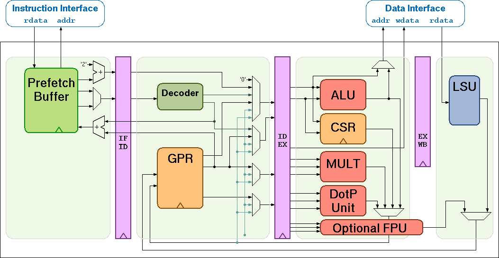

# 简介

CV32E40P是一个**顺序**（发射、执行）的**四级**流水线**32位**RISC-V处理器。CV32E40P的指令集包含了一部分的自定义扩展指令集，包括有：硬件循环（hardware loops）、地址自增的访存指令（post-increment load and store）以及额外的一系列ALU指令（算术指令扩展、乘累加MAC、向量操作等等）。图1.1为处理器流水线的总体示意图。

## 所符合的标准

CV32E40P是一个符合指令集标准的32位RISC-V处理器。它所符合的标准有：

- [RISC-V Instruction Set Manual, Volume I: User-Level ISA, Document Version 20191213](https://github.com/riscv/riscv-isa-manual/releases/download/Ratified-IMAFDQC/riscv-spec-20191213.pdf)
- [RISC-V Instruction Set Manual, Volume II: Privileged Architecture, document version 20190608-Base-Ratified](https://github.com/riscv/riscv-isa-manual/releases/download/Ratified-IMFDQC-and-Priv-v1.11/riscv-privileged-20190608.pdf)。CV32E40P实现了机器模式ISA 1.11版本。
- [RISC-V External Debug Support, version 0.13.2](https://content.riscv.org/wp-content/uploads/2019/03/riscv-debug-release.pdf)

RISC-V标准中大量的特性是可选的，因此CV32E40P可以使用不同的参数来实现/禁用它们。

CV32E40P支持以下基本指令集：

- The RV32I Base Integer Instruction Set, version 2.1（RV32I）

此外，以下的标准扩展也同样可用：

| 标准指令集扩展                  | 版本 | 可配置性                |
| :------------------------------ | :--- | ----------------------- |
| **C**：压缩指令标准扩展         | 2.0  | 总是实现的              |
| **M**：乘除法指令标准扩展       | 2.0  | 总是实现的              |
| **Zicount**：性能计数器标准扩展 | 2.0  | 总是实现的              |
| **Zicsr**：CSR指令              | 2.0  | 总是实现的              |
| **Zifencei**：取指屏障          | 2.0  | 总是实现的              |
| **F**：单精度浮点数标准扩展     | 2.2  | 可选，由参数`FPU`来指定 |

下列的自定义指令集扩展同样可用：

| 自定义指令集扩展                              | 版本 | 可配置性                         |
| --------------------------------------------- | ---- | -------------------------------- |
| **Xcorev**：CORE-V指令集扩展                  | 1.0  | 可选，由参数`PULP_XPULP`来指定   |
| **Xpulpcluster**：PULP Cluster扩展            | 1.0  | 可选，由参数`PULP_CLUSTER`来指定 |
| **Xpulpzfinx**：PULP共享整型/浮点型寄存器扩展 | 1.0  | 可选，由参数`PULP_ZFINX`来指定   |

大部分RISC-V特权级文档的内容都是可选的。目前CV32E40P支持下列RISC-V特权级文档v1.11版本的内容：

- 机器模式（M-Mode）
- 在[*控制与状态寄存器*]()一节中所列出的所有CSRs
- 基于`NUM_MHPMCOUNTERS`参数的在[*性能计数器*]()一节中描述的硬件性能计数器
- 中断/异常处理支持直接模式（direct mode）以及向量模式（vectored mode）

## 参考文献

[1] [Gautschi, Michael, et al. “Near-Threshold RISC-V Core With DSP Extensions for Scalable IoT Endpoint Devices.” in IEEE Transactions on Very Large Scale Integration (VLSI) Systems, vol. 25, no. 10, pp. 2700- 2713, Oct. 2017](https://ieeexplore.ieee.org/document/7864441)

[2] [Schiavone, Pasquale Davide, et al. “Slow and steady wins the race? A comparison of ultra-low-power RISC- V cores for Internet-of-Things applications.” 27th International Symposium on Power and Timing Modeling, Optimization and Simulation (PATMOS 2017)](https://doi.org/10.1109/PATMOS.2017.8106976)