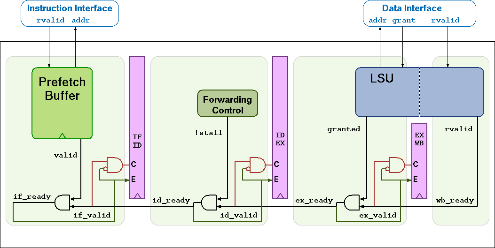

# 内核集成

CV32E40P的主模块为`cv32e40p_core`，位于文件`cv32e40p_core.sv`。下面给出一个实例化该模块的参数以及接口设置的模版。


## 初始化模版

```verilog
cv32e40p_core #(
      .FPU                      ( 0 ),
      .NUM_MHPMCOUNTERS         ( 1 ),
      .PULP_CLUSTER             ( 0 ),
      .PULP_XPULP               ( 0 ),
      .PULP_ZFINX               ( 0 )
  ) u_core (
      // Clock and reset
      .clk_i                    (),
      .rst_ni                   (),
      .scan_cg_en_i             (),

      // Configuration
      .boot_addr_i              (),
      .mtvec_addr_i             (),
      .dm_halt_addr_i           (),
      .dm_exception_addr_i      (),
      .hart_id_i                (),

      // Instruction memory interface
      .instr_req_o              (),
      .instr_gnt_i              (),
      .instr_rvalid_i           (),
      .instr_addr_o             (),
      .instr_rdata_i            (),

      // Data memory interface
      .data_req_o               (),
      .data_gnt_i               (),
      .data_rvalid_i            (),
      .data_addr_o              (),
      .data_be_o                (),
      .data_wdata_o             (),
      .data_we_o                (),
      .data_rdata_i             (),

      // Auxiliary Processing Unit (APU) interface
      .apu_req_o                (),
      .apu_gnt_i                (),
      .apu_operands_o           (),
      .apu_op_o                 (),
      .apu_flags_o              (),
      .apu_rvalid_i             (),
      .apu_result_i             (),
      .apu_flags_i              (),

       // Interrupt interface
      .irq_i                    (),
      .irq_ack_o                (),
      .irq_id_o                 (),

      // Debug interface
      .debug_req_i              (),
      .debug_havereset_o        (),
      .debug_running_o          (),
      .debug_halted_o           (),

      // Special control signals
      .fetch_enable_i           (),
      .core_sleep_o             (),
      .pulp_clock_en_i          ()
  );
```


## 参数

> **注意**：参数`FPU`、`PULP_CLUSTER`、`PULP_XPULP`以及`PULP_ZFINX`的非默认（非0）值的设定还未验证。参数`PULP_XPULP`的默认值在其经过验证后将会更改为1。下列展示的默认的参数设置都是已经经过验证的功能。

> **注意**：PULP指令编码应该改为非向后兼容的形式，具体请参考该[issue](https://github.com/openhwgroup/cv32e40p/issues/452)。（此问题还未细看）

| 名称               | 类型/范围     | 默认值 | 描述                                                         |
| ------------------ | ------------- | ------ | ------------------------------------------------------------ |
| `FPU`              | 单比特位      | 0      | 配置浮点运算单元（FPU）支持，参见[*浮点运算单元*]()一节      |
| `NUM_MHPMCOUNTERS` | int (0 .. 29) | 1      | 性能计数器的数量，参见[*性能计数器*]()一节                   |
| `PULP_CLUSTER`     | 单比特位      | 0      | 配置PULP Cluster支持，参见[*PULP Cluster扩展*]()一节         |
| `PULP_XPULP`       | 单比特位      | 0      | 配置所有自定义PULP指令集扩展的内容（除**cv.elw**以外）（参见[*CORE-V指令集扩展*]()一节）以及所有自定义CSRs的内容（参见[*控制与状态寄存器*]()一节）。PULP指令集扩展包括有如：地址自增的访存指令（参见[*地址自增访存指令以及寄存器-寄存器加载&存储指令*]()一节）以及硬件循环（参见[*硬件循环*]()一节） |
| `PULP_ZFINX`       | 单比特位      | 0      | 配置浮点相关指令使用通用寄存器组而不是特定的浮点寄存器组，参见[*浮点运算单元*]()一节。该参数只有在`FPU`=1时才能设为1。 |


## 接口

| 信号                  | 宽度 | 方向 | 描述                   |
| --------------------- | ---- | ---- | ---------------------- |
| `clk_i`               | 1    | 输入 | 时钟信号               |
| `rst_ni`              | 1    | 输入 | 低电平触发异步重置信号 |
| `scan_cg_en_i`        | 1    | 输入 | 扫描时钟门控使能端口，是可测试性设计（Design-for-test，DFT）相关的端口。可以在进行扫描链[^1]测试中强制使能时钟门控。这个信号在通常的操作中需要置为0。 |
| `boot_addr_i`         | 32   | 输入 | 启动地址。当处理器重置后程序计数器的地址将会设置为=`boot_addr_i`。必须与半字长对齐。在通过`fetch_enable_i`启用内核后不要更改。 |
| `mtvec_addr_i`        | 32   | 输入 | `mtvec`地址。[*机器异常向量基地址（mtvec）*]()的初始值。在通过`fetch_enable_i`启动内核后不要更改。 |
| `dm_halt_addr_i`      | 32   | 输入 | 在进入调试模式后跳转的地址，参见[*调试与触发*]()一节。在通过`fetch_enable_i`启动内核后不要更改。 |
| `dm_exception_addr_i` | 32   | 输入 | 在调试模式中发生异常时跳转的地址，参见[*调试与触发*]()一节。该地址必须与字长对齐。在通过`fetch_enable_i`启动内核后不要更改。 |
| `hart_id_i`           | 32   | 输入 | 硬件线程（Hardware Thread，Hart）ID，一般来说是不变的。参见[*硬件线程ID（mhartid）*]()以及[*用户硬件线程ID（uhartid）*]()。 |
| `instr_*`             | - |-|取指接口，参见[*取指*]()。|
| `data_*`              | -    | -    | 加载存储单元接口，参见[*加载存储单元（LSU）*]()一节。 |
| `apu_*`               | -    | -    | 辅助处理单元接口，参见[*辅助处理单元（APU）*]()一节。 |
| `irq_*`               | -    | -    | 中断输入，参见[*异常与中断*]()一节。 |
| `debug_*`             | -    | -    | 调试接口，参见[*调试与触发*]()一节。 |
| `fetch_enable_i`      | 1    | 输入 | 启用CV32E40P进行取指。在重置后第一次的取指在该端口为0时不会执行。`fetch_enable_i`需要在非重置时至少在一个周期置为1才能启用取指。当取指启用后，该端口的值将会忽略。 |
| `core_sleep_o`        | 1    | 输出 | 表示内核是否处于睡眠状态，参见[*睡眠单元*]()一节。 |
| `pulp_clock_en_i`     | 1    | 输入 | PULP时钟使能（当且仅当`PULP_CLUSTER`=1时使用，其他情况请置为0），参见[*睡眠单元*]()一节。 |

[^1]: 扫描链（Scan chain）是可测试性设计的一种实现技术。它通过植入移位寄存器，使得测试人员可以从外部控制和观测电路内部触发器的信号值。

